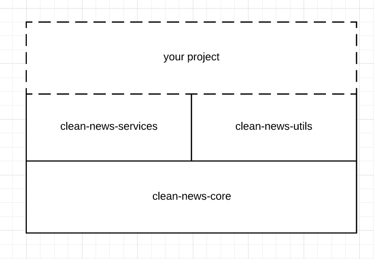

# clean-news

Clean News is a series of projects that provide tools to access and process both media outlets articles and trends from social network as Twitter.

## Motivation

It is based on a series of assertions about the modern landscape of media outlets:

 - Media outlets are turning into advertisement companies: the home page (or other pages) of all mainstream outlets are filled with ads, that have nothing to do with the information citizens need to get informed and participate in democratic societies.
 - Media outlets are owned by people who want to pass their agendas and make them the agenda of the society.
 - It is hard to get properly informed: for every outlet you read you must sort into what is important and is not. You must then check if that specific outlet is not showing a piece  of information that is important because of editorial opinions. Is the sentiment in the wording of the article biased? In order to form proper opinions you should scroll through countless of outlets and spend time and effort that most people today do not have.
 
So we can identify three main obstacles to getting informed and forming opinions:
 
- Ads
- Biases
- Time and effort

When you got through a medium you will find yourself bombarded with **ads**, read articles that will probably be **biased** and in order to get rid of these biases you will need **time and effort** to traverse other ad-filled and biased media.

Clean News tries to reduce the time and effort need to overcome these obstacles by providing tools to showing its users processed information. 

## Structure

As of today, Clean News is comprised by three projects:

- [clean-news-core](https://github.com/ropa1998/clean-news-core): the basic elements to making any clean news project. This is considered high level code that should not change.
- [clean-news-services](https://github.com/ropa1998/clean-news-services): pre-made tools to access articles and trends. This is tested and maintained code. You could arrive to similar results by just using clean-news-core. It is just a set of tools officially maintained.
- [clean-news-utils](https://github.com/ropa1998/clean-news-utils): utils for different actions you might want to do with your results. As of today it is just a flusher tool that allows you to show the results of the run of your code.

In order to build any project based on this code we recommend the following structure:

Because we do not have any of our code in repositories you can use in Gradle or Maven in order to use our code you must download it, build it and then compile it in your project.

## License

All of our code is under the [GNU General Public License v3.0](LICENSE)

